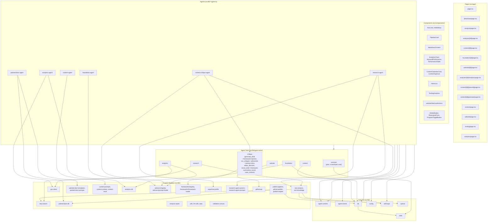
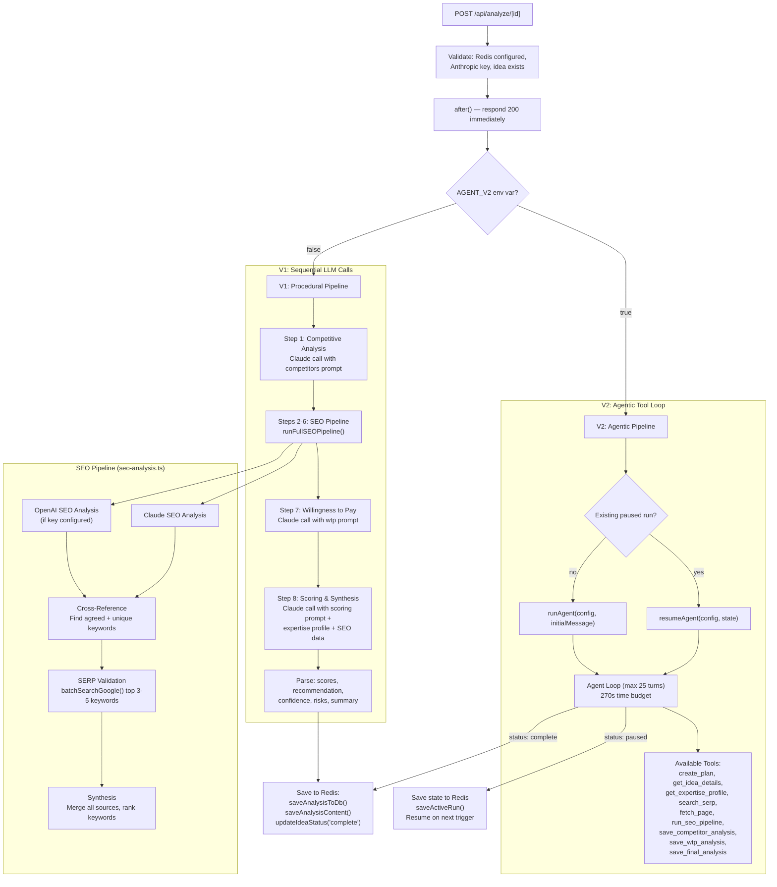
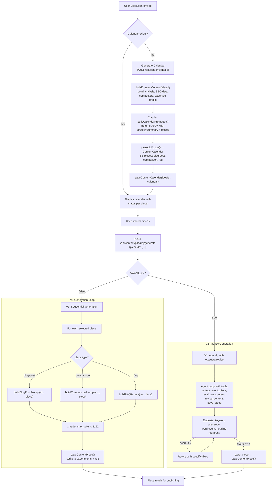
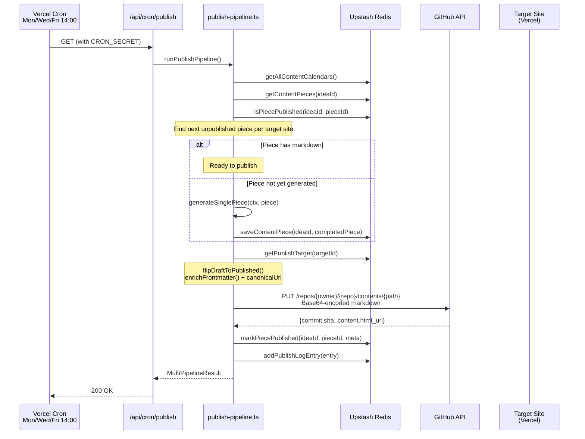
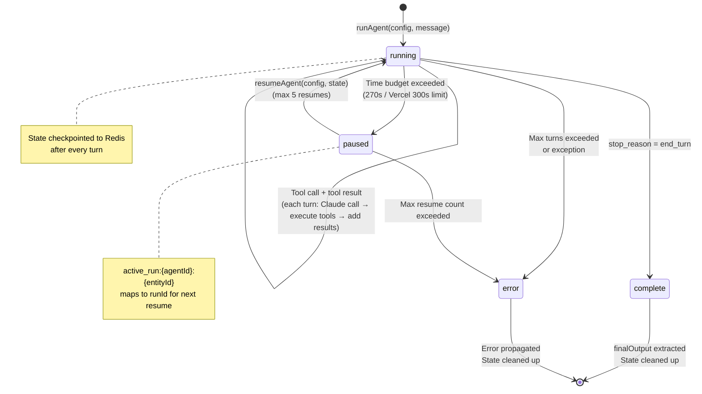

# Architecture Reference

Visual architecture reference for the EPCH Product Concept Testing Pipeline. A Next.js 16 app deployed on Vercel that manages the full lifecycle of product idea validation through SEO-driven content marketing. Five AI agents (Research, Content, Foundation, Website, Analytics) powered by a shared agent runtime with pause/resume capability.

---

## High-Level Architecture

```mermaid
graph TB
    subgraph Client["Client (Next.js Pages)"]
        HOME["/ (Home)<br/>Pipeline overview"]
        IDEATION["/ideation<br/>Ideation stage"]
        IDEAS["/ideas/new<br/>Idea submission"]
        ANALYSIS["/analysis<br/>Leaderboard"]
        DETAIL["/analyses/[id]<br/>Project dashboard"]
        CONTENT_OV["/content<br/>Content overview"]
        CONTENT_DETAIL["/content/[id]<br/>Content calendar"]
        WEBSITE_OV["/website<br/>Painted door sites"]
        WEBSITE_DETAIL["/website/[id]<br/>Site generation"]
        TESTING["/testing<br/>SEO performance"]
        OPTIMIZATION["/optimization<br/>Optimization stage"]
        ANALYTICS["/analytics<br/>Weekly reports"]
        FOUNDATION_EDIT["/foundation/[id]/edit/[docType]<br/>Document editor"]
    end

    subgraph API["API Routes"]
        API_IDEAS["/api/ideas<br/>CRUD"]
        API_ANALYZE["/api/analyze/[id]<br/>POST triggers, GET polls"]
        API_ANALYSES["/api/analyses<br/>List & detail"]
        API_CONTENT_CAL["/api/content/[ideaId]<br/>Calendar: POST generate, GET, PATCH"]
        API_CONTENT_GEN["/api/content/[ideaId]/generate<br/>POST triggers, GET polls"]
        API_CONTENT_PIECES["/api/content/[ideaId]/pieces<br/>GET list pieces"]
        API_CONTENT_PIECE["/api/content/[ideaId]/pieces/[pieceId]<br/>GET, PATCH reject, DELETE"]
        API_CONTENT_PROGS["/api/content/programs<br/>Program management"]
        API_FOUNDATION["/api/foundation/[ideaId]<br/>POST triggers, GET polls, PATCH saves"]
        API_FOUNDATION_CHAT["/api/foundation/[ideaId]/chat<br/>POST streaming chat"]
        API_PD["/api/painted-door/[id]<br/>Site generation"]
        API_PD_SITES["/api/painted-door/sites<br/>List sites"]
        API_PUBLISH["/api/publish/status<br/>Publish log"]
        API_PUB_TARGETS["/api/publish-targets<br/>Target management"]
        API_GSC["/api/gsc/[ideaId]<br/>GSC data & linking"]
        API_ANALYTICS_RPT["/api/analytics/report<br/>Weekly reports"]
        API_CRON_PUB["/api/cron/publish<br/>Vercel Cron: Mon/Wed/Fri 14:00"]
        API_CRON_ANA["/api/cron/analytics<br/>Vercel Cron: Sun 09:00"]
    end

    subgraph Agents["AI Agent Layer"]
        RESEARCH["Research Agent<br/>research-agent.ts"]
        CONTENT_AGENT["Content Agent<br/>content-agent.ts"]
        FOUNDATION["Foundation Agent<br/>foundation-agent.ts"]
        PAINTED_DOOR["Website Agent<br/>painted-door-agent.ts"]
        ANALYTICS_AGENT["Analytics Agent<br/>analytics-agent.ts"]
        CRITIQUE["Content Critique Agent<br/>content-critique-agent.ts"]
        RUNTIME["Agent Runtime<br/>agent-runtime.ts"]
    end

    subgraph External["External Services"]
        CLAUDE["Anthropic Claude<br/>(claude-sonnet-4-20250514)"]
        OPENAI["OpenAI<br/>(gpt-4o-mini)"]
        SERPAPI["SerpAPI<br/>SERP validation"]
        GSC["Google Search Console<br/>Performance data"]
        GITHUB["GitHub API<br/>Repo management"]
        VERCEL["Vercel API<br/>Project deployment"]
    end

    subgraph Data["Data Layer"]
        REDIS[("Upstash Redis<br/>All persistence")]
        FS["Filesystem<br/>experiments/ (local dev)"]
    end

    Client -->|fetch| API
    API -->|triggers via after()| Agents
    Agents -->|invoke| RUNTIME
    RUNTIME -->|messages.create| CLAUDE
    RESEARCH -->|SEO cross-reference| OPENAI
    RESEARCH -->|keyword validation| SERPAPI
    ANALYTICS_AGENT -->|fetch analytics| GSC
    PAINTED_DOOR -->|create repo, push files| GITHUB
    PAINTED_DOOR -->|create project, deploy| VERCEL
    Agents -->|read/write| REDIS
    API -->|read/write| REDIS
    API_IDEAS -.->|fallback| FS
```

---

## Module Dependency Map



---

## Library Module Map

```mermaid
graph TB
    subgraph Runtime["Agent Infrastructure"]
        agent_runtime["agent-runtime.ts<br/>Core agentic loop: runAgent(), resumeAgent()<br/>State persistence, time-budget pause,<br/>tool execution, Vercel 270s safety margin"]
        agent_events["agent-events.ts<br/>Inter-agent event bus via Redis lists<br/>emitEvent(), getEvents(), clearEvents()"]
        config["config.ts<br/>Model constants: claude-sonnet-4-20250514, gpt-4o-mini"]
    end

    subgraph Clients["API Clients (singleton pattern)"]
        anthropic["anthropic.ts<br/>getAnthropic() — lazy Anthropic SDK client"]
        openai["openai.ts<br/>getOpenAI() — lazy OpenAI SDK client"]
        redis_mod["redis.ts<br/>getRedis() — lazy Upstash Redis client<br/>parseValue(), isRedisConfigured()"]
        gsc_client["gsc-client.ts<br/>Google Search Console via JWT auth<br/>fetchSearchAnalytics(), listProperties()"]
        serp_search["serp-search.ts<br/>SerpAPI wrapper<br/>batchSearchGoogle(), isSerpConfigured()"]
    end

    subgraph Persistence["Data Access"]
        db["db.ts<br/>Primary data layer (Redis): ideas, analyses,<br/>content calendars, pieces, GSC links,<br/>publish tracking, foundation docs"]
        analytics_db["analytics-db.ts<br/>Analytics persistence: weekly snapshots,<br/>site snapshots, reports, alerts"]
        painted_door_db["painted-door-db.ts<br/>Painted door sites, progress,<br/>dynamic publish targets"]
        data["data.ts<br/>Filesystem fallback for local dev<br/>ideas.json CRUD, experiments/ markdown parsing"]
    end

    subgraph DomainLogic["Domain Logic"]
        seo_analysis["seo-analysis.ts<br/>Multi-source SEO pipeline: Claude + OpenAI<br/>keyword extraction, cross-reference,<br/>SERP validation, synthesis"]
        seo_knowledge["seo-knowledge.ts<br/>Vertical detection, scoring guidelines,<br/>SERP criteria, content gap types"]
        expertise_profile["expertise-profile.ts<br/>Owner expertise profile for scoring<br/>Domain depths, credentials, overlap categories"]
        publish_pipeline["publish-pipeline.ts<br/>Cron-driven content publishing orchestrator<br/>findNextPiecePerTarget(), runPublishPipeline()"]
        github_publish["github-publish.ts<br/>GitHub Contents API: commit, update, delete files<br/>Frontmatter enrichment, draft→published flip"]
        publish_targets["publish-targets.ts<br/>Static + dynamic publish targets<br/>secondlook, study-platform, painted-door sites"]
    end

    subgraph Prompts["Prompt Engineering"]
        content_prompts["content-prompts.ts<br/>Content generation prompts per type<br/>buildCalendarPrompt(), buildBlogPostPrompt(),<br/>buildComparisonPrompt(), buildFAQPrompt()"]
        painted_door_prompts["painted-door-prompts.ts<br/>Brand identity generation prompt"]
        painted_door_templates["painted-door-templates.ts<br/>Next.js site templates (~21 files)<br/>assembleAllFiles()"]
    end

    subgraph Frameworks["Frameworks"]
        frameworks_registry["frameworks/registry.ts<br/>Framework metadata registry"]
        frameworks_loader["frameworks/framework-loader.ts<br/>getFrameworkPrompt(frameworkId)<br/>Reads prompt.md from disk"]
        frameworks_prompts["frameworks/prompts/<br/>Per-framework prompt + examples"]
    end

    subgraph Advisors["Virtual Board"]
        advisors_registry["advisors/registry.ts<br/>13 advisors: Richard Rumelt, April Dunford,<br/>Brand Copywriter, SEO Expert, Shirin Oreizy,<br/>Joe Pulizzi, Robb Wolf, Patrick Campbell,<br/>Robbie Kellman Baxter, Rob Walling"]
        advisors_loader["advisors/prompt-loader.ts<br/>getAdvisorSystemPrompt(advisorId)"]
        advisors_prompts["advisors/prompts/<br/>Per-advisor .md system prompts"]
    end

    subgraph Frameworks["Framework Library"]
        frameworks_registry["frameworks/registry.ts<br/>Framework definitions and metadata"]
        frameworks_loader["frameworks/framework-loader.ts<br/>Load prompt.md, examples.md, anti-examples.md"]
        frameworks_types["frameworks/types.ts<br/>Framework type definitions"]
        frameworks_prompts["frameworks/prompts/<br/>3 frameworks: content-inc-model,<br/>forever-promise, value-metric"]
    end

    subgraph Utilities["Utilities"]
        utils["utils.ts<br/>slugify(), fuzzyMatchPair(),<br/>formatScoreName(), buildLeaderboard()"]
        llm_utils["llm-utils.ts<br/>parseLLMJson(), cleanJSONString()<br/>Handles code fences, trailing commas"]
    end
```



---

## Primary User Flows

```mermaid
graph LR
    subgraph Ideation
        A1["User visits /ideas/new"] --> A2["Fills idea form:<br/>name, description,<br/>target user, problem, URL"]
        A2 --> A3["POST /api/ideas"]
        A3 --> A4["Saved to Redis<br/>status: pending"]
    end

    subgraph Analysis
        A4 --> B1["User clicks Analyze"]
        B1 --> B2["POST /api/analyze/[id]"]
        B2 --> B3["after() fires<br/>runResearchAgentAuto()"]
        B3 --> B4{"AGENT_V2?"}
        B4 -->|v1| B5["Sequential LLM calls:<br/>Competitors → SEO Pipeline →<br/>WTP → Scoring"]
        B4 -->|v2| B6["Agentic loop with<br/>search_serp, fetch_page,<br/>run_seo_pipeline tools"]
        B5 --> B7["Analysis saved to Redis<br/>status: complete"]
        B6 --> B7
    end

    subgraph Foundation
        B7 --> C1["User visits Foundation tab"]
        C1 --> C2["POST /api/foundation/[ideaId]"]
        C2 --> C3["Foundation Agent generates 6 docs:<br/>strategy → positioning →<br/>brand-voice, design-principles,<br/>seo-strategy, social-media-strategy"]
    end

    subgraph Website
        B7 --> D1["User clicks Build Website"]
        D1 --> D2["POST /api/painted-door/[id]"]
        D2 --> D3["Pipeline: Brand Identity →<br/>Assemble Files → GitHub Repo →<br/>Push → Vercel Project →<br/>Deploy → Register Target"]
        D3 --> D4["Live site on Vercel<br/>with email signup"]
    end

    subgraph Content
        B7 --> E1["User visits Content tab"]
        E1 --> E2["Generate Calendar"]
        E2 --> E3["POST /api/content/[ideaId]"]
        E3 --> E4["Calendar with 3-5 pieces:<br/>blog-post, comparison, faq"]
        E4 --> E5["Select pieces → Generate"]
        E5 --> E6["POST /api/content/[ideaId]/generate"]
        E6 --> E7["Pieces generated<br/>with YAML frontmatter"]
    end

    subgraph Publishing
        E7 --> F1["Cron: Mon/Wed/Fri 14:00 UTC"]
        F1 --> F2["GET /api/cron/publish"]
        F2 --> F3["findNextPiecePerTarget()"]
        F3 --> F4["commitToRepo() via<br/>GitHub Contents API"]
        F4 --> F5["markPiecePublished()"]
    end

    subgraph Analytics
        F5 --> G1["Cron: Sunday 09:00 UTC"]
        G1 --> G2["GET /api/cron/analytics"]
        G2 --> G3["Fetch GSC data → Match to pieces →<br/>Compare weeks → Detect changes"]
        G3 --> G4["Weekly report with<br/>alerts and insights"]
    end
```



---

## Research Agent Flow (Detailed)



---

## Content Pipeline Flow (Detailed)



---

## Request/Response Lifecycle: Analyze Flow

```mermaid
sequenceDiagram
    participant UI as Browser
    participant Page as /ideas/[id]/analyze
    participant API as /api/analyze/[id]
    participant DB as Upstash Redis
    participant Runtime as Agent Runtime
    participant Claude as Anthropic Claude
    participant OpenAI as OpenAI (optional)
    participant SERP as SerpAPI (optional)

    UI->>Page: Click "Analyze"
    Page->>API: POST /api/analyze/{id}
    API->>DB: getIdeaFromDb(id)
    DB-->>API: ProductIdea
    Note over API: Respond 200 immediately
    API-->>UI: {message: "Analysis started"}

    Note over API: after() callback fires

    API->>DB: updateIdeaStatus(id, "analyzing")
    API->>DB: saveProgress(id, {status: running})

    rect rgb(40, 40, 60)
        Note over API,Claude: Step 1: Competitive Analysis
        API->>Claude: messages.create(competitors prompt)
        Claude-->>API: Competitor markdown
    end

    rect rgb(40, 40, 60)
        Note over API,SERP: Steps 2-6: SEO Pipeline
        API->>Claude: Claude SEO analysis
        API->>OpenAI: OpenAI SEO analysis (parallel)
        Claude-->>API: Claude keywords
        OpenAI-->>API: OpenAI keywords
        Note over API: Cross-reference keywords
        API->>SERP: batchSearchGoogle(top keywords)
        SERP-->>API: SERP results + People Also Ask
        Note over API: Synthesize all sources
    end

    rect rgb(40, 40, 60)
        Note over API,Claude: Step 7: Willingness to Pay
        API->>Claude: messages.create(WTP prompt)
        Claude-->>API: WTP analysis
    end

    rect rgb(40, 40, 60)
        Note over API,Claude: Step 8: Scoring
        API->>Claude: messages.create(scoring + expertise + SEO data)
        Claude-->>API: Scores, recommendation, risks
    end

    API->>DB: saveAnalysisToDb(analysis)
    API->>DB: saveAnalysisContent(id, {main, competitors, keywords, seoData})
    API->>DB: updateIdeaStatus(id, "complete")

    loop UI Polling (every 2s)
        UI->>API: GET /api/analyze/{id}
        API->>DB: getProgress(id)
        DB-->>API: AnalysisProgress
        API-->>UI: {status, currentStep, steps[]}
    end
```



---

## Publish Pipeline Flow



---

## Database Schema (Redis Keys)

```mermaid
graph LR
    subgraph Hashes["Hash Maps (HSET/HGET)"]
        H_IDEAS["ideas<br/>field: ideaId → ProductIdea JSON"]
        H_ANALYSES["analyses<br/>field: id → Analysis JSON"]
        H_CONTENT["analysis_content<br/>field: id → AnalysisContent JSON"]
        H_GSC_LINKS["gsc_links<br/>field: ideaId → GSCPropertyLink JSON"]
        H_CONTENT_PIECES["content_pieces:{ideaId}<br/>field: pieceId → ContentPiece JSON"]
        H_PD_SITES["painted_door_sites<br/>field: ideaId → PaintedDoorSite JSON"]
        H_PD_TARGETS["painted_door_targets<br/>field: targetId → PublishTarget JSON"]
        H_PUB_META["published_pieces_meta<br/>field: ideaId:pieceId → PublishedPieceMeta"]
        H_REJECTED["rejected_pieces:{ideaId}<br/>field: id → RejectedPiece JSON"]
        H_SNAP["analytics:snapshot:{weekId}<br/>field: ideaId:pieceId → PieceSnapshot"]
    end

    subgraph Strings["Key-Value (SET/GET)"]
        S_PROGRESS["progress:{ideaId}<br/>AnalysisProgress (1hr TTL)"]
        S_CAL["content_calendar:{ideaId}<br/>ContentCalendar JSON"]
        S_CPROG["content_progress:{ideaId}<br/>ContentProgress (1hr TTL)"]
        S_GSC_CACHE["gsc_analytics:{ideaId}<br/>GSCAnalyticsData (4hr TTL)"]
        S_GSC_PROPS["gsc_properties_cache<br/>GSC properties (1hr TTL)"]
        S_AGENT["agent_state:{runId}<br/>AgentState (2hr TTL)"]
        S_ACTIVE["active_run:{agentId}:{entityId}<br/>runId string (2hr TTL)"]
        S_PD_PROG["painted_door_progress:{ideaId}<br/>PaintedDoorProgress (1hr TTL)"]
        S_FOUND["foundation:{ideaId}:{docType}<br/>FoundationDocument JSON"]
        S_FOUND_PROG["foundation_progress:{ideaId}<br/>FoundationProgress (1hr TTL)"]
        S_SITE_SNAP["analytics:site_snapshot:{weekId}<br/>Site totals (26wk TTL)"]
        S_REPORT["analytics:report:{weekId}<br/>WeeklyReport (52wk TTL)"]
        S_LATEST["analytics:report:latest<br/>Latest WeeklyReport"]
        S_DRAFT["draft:{runId}<br/>Current draft (2hr TTL)"]
        S_CRIT_ROUND["critique_round:{runId}:{round}<br/>Full round data (2hr TTL)"]
        S_PIPE_PROG["pipeline_progress:{runId}<br/>Structured progress (2hr TTL)"]
        S_APPROVED["approved_content:{runId}<br/>Approved content (2hr TTL)"]
        S_CANVAS["canvas:{ideaId}<br/>CanvasState JSON"]
        S_ASSUMPTION["assumption:{ideaId}:{type}<br/>Assumption JSON"]
        S_PIVOT_SUG["pivot-suggestions:{ideaId}:{type}<br/>PivotSuggestion[] JSON"]
        S_PIVOT_HIST["pivots:{ideaId}:{type}<br/>PivotRecord[] JSON"]
    end

    subgraph Sets["Sets (SADD/SMEMBERS)"]
        SET_PUB["published_pieces<br/>{ideaId}:{pieceId} members"]
    end

    subgraph Lists["Lists (RPUSH/LRANGE)"]
        L_EVENTS["agent_events:{ideaId}<br/>AgentEvent JSON (24hr TTL)"]
        L_LOG["publish_log<br/>Last 50 PublishLogEntry"]
    end

    subgraph KV_Scratchpad["Scratchpad (inter-agent)"]
        SP["scratchpad:{ideaId}<br/>field: key → value"]
    end
```



---

## Agent Runtime State Machine



---

## Foundation Document Generation Order

```mermaid
flowchart LR
    STRATEGY["strategy<br/>(Seth Godin)"] --> POSITIONING["positioning<br/>(April Dunford)"]
    POSITIONING --> VOICE["brand-voice<br/>(Copywriter)"]
    POSITIONING --> DESIGN["design-principles<br/>(Richard Rumelt)"]
    STRATEGY --> DESIGN
    POSITIONING --> SEO_STRAT["seo-strategy<br/>(SEO Expert)"]
    POSITIONING --> SOCIAL["social-media-strategy<br/>(April Dunford)"]
    VOICE --> SOCIAL

    style STRATEGY fill:#1a3a4a,stroke:#4ade80
    style POSITIONING fill:#1a3a4a,stroke:#4ade80
    style VOICE fill:#1a2a3a,stroke:#60a5fa
    style DESIGN fill:#1a2a3a,stroke:#60a5fa
    style SEO_STRAT fill:#1a2a3a,stroke:#60a5fa
    style SOCIAL fill:#1a2a3a,stroke:#60a5fa
```



Each doc depends on its predecessors. Strategy is generated first (core diagnosis + guiding policy), then positioning (category, competitive alternatives, differentiators), then four downstream docs. Design-principles depends on both strategy and positioning. Social-media-strategy depends on both positioning and brand-voice.

---

## Cron Jobs

| Schedule | Route | Function | What It Does |
|----------|-------|----------|-------------|
| Mon/Wed/Fri 14:00 UTC | `/api/cron/publish` | `runPublishPipeline()` | Finds next unpublished piece per target site. Generates content if needed. Commits to GitHub repo via Contents API. Marks as published. |
| Sunday 09:00 UTC | `/api/cron/analytics` | `runAnalyticsAgentAuto()` | Fetches 7-day GSC data (with 3-day delay). Matches pages to published pieces. Compares week-over-week. Generates alerts and insights report. |

Both cron routes validate `CRON_SECRET` on GET (Vercel Cron) and accept unauthenticated POST for manual dashboard triggers.

---

## Quick Reference

### Pages

| Area | File | Purpose |
|------|------|---------|
| Home | `src/app/page.tsx` | Pipeline overview with stage cards and counts |
| Ideation | `src/app/ideation/page.tsx` | Ideation stage landing page |
| New Idea | `src/app/ideas/new/page.tsx` | Idea submission form |
| Ideas (Analyze) | `src/app/ideas/[id]/analyze/page.tsx` | Triggers analysis, shows progress |
| Analysis List | `src/app/analysis/page.tsx` | Leaderboard of analyzed ideas |
| Analysis Detail | `src/app/analyses/[id]/page.tsx` | Analysis overview (scores, recommendation) |
| Content Tab | `src/app/content/[id]/page.tsx` | Content calendar and piece management |
| Generate Content | `src/app/content/[id]/generate/page.tsx` | Content generation progress view |
| View Piece | `src/app/content/[id]/[pieceId]/page.tsx` | Individual content piece view |
| Foundation Tab | `src/app/foundation/[id]/page.tsx` | Foundation document viewer/generator |
| Foundation Editor | `src/app/foundation/[id]/edit/[docType]/page.tsx` | Split-pane document editor with advisor chat |
| Website Tab | `src/app/website/[id]/page.tsx` | Website generation status + regenerate |
| Analytics Tab | `src/app/analyses/[id]/analytics/page.tsx` | Per-idea GSC analytics |
| Content Overview | `src/app/content/page.tsx` | Cross-idea content dashboard |
| Website | `src/app/website/page.tsx` | All painted door sites + publish targets |
| Testing | `src/app/testing/page.tsx` | SEO performance dashboard |
| Optimization | `src/app/optimization/page.tsx` | Optimization stage landing page |
| Analytics | `src/app/analytics/page.tsx` | Weekly analytics reports |

### API Routes

| Area | Route | Methods | Purpose |
|------|-------|---------|---------|
| Ideas | `/api/ideas` | GET, POST, PATCH, DELETE | CRUD for product ideas (Redis + filesystem fallback) |
| Analysis | `/api/analyze/[id]` | POST, GET | POST triggers agent; GET polls progress |
| Analyses | `/api/analyses` | GET | List all analyses |
| Analysis Detail | `/api/analyses/[id]` | GET, DELETE | Fetch/delete analysis with full content |
| Content Calendar | `/api/content/[ideaId]` | POST, GET, PATCH | POST generates calendar (or appends pieces); GET fetches calendar; PATCH updates target/order |
| Content Pieces | `/api/content/[ideaId]/pieces` | GET | List all content pieces for an idea |
| Content Piece | `/api/content/[ideaId]/pieces/[pieceId]` | GET, PATCH, DELETE | GET single piece; PATCH rejects piece; DELETE removes from target repo |
| Content Generate | `/api/content/[ideaId]/generate` | POST, GET | POST triggers generation; GET polls progress |
| Content Programs | `/api/content/programs` | GET, PATCH | List/toggle content programs |
| Foundation | `/api/foundation/[ideaId]` | POST, GET, PATCH | POST triggers generation; GET returns docs + progress; PATCH saves edits |
| Foundation Chat | `/api/foundation/[ideaId]/chat` | POST | Streaming advisor conversation for document editing |
| Painted Door | `/api/painted-door/[id]` | POST, GET | POST triggers site build; GET returns status |
| Painted Door Sites | `/api/painted-door/sites` | GET | List all painted door sites |
| Publish Targets | `/api/publish-targets` | GET | List all publish targets (static + dynamic) |
| Publish Status | `/api/publish/status` | GET | Fetch publish log |
| GSC Data | `/api/gsc/[ideaId]` | GET, DELETE | Fetch/clear GSC analytics for idea |
| GSC Link | `/api/gsc/[ideaId]/link` | POST, DELETE | Link/unlink GSC property to idea |
| GSC Properties | `/api/gsc/properties` | GET | List available GSC properties |
| Analytics Report | `/api/analytics/report` | GET | Fetch weekly report |
| Cron: Publish | `/api/cron/publish` | GET, POST | Cron + manual publish trigger |
| Cron: Analytics | `/api/cron/analytics` | GET, POST | Cron + manual analytics trigger |
| Content Pipeline | `/api/content-pipeline/[ideaId]` | POST, GET | POST triggers critique pipeline; GET polls progress |
| Validation Canvas | `/api/validation/[ideaId]` | GET | Full canvas state with assumptions and pivot suggestions |
| Validation Status | `/api/validation/[ideaId]/status` | POST | Manually update assumption status (validate/invalidate) |
| Validation Pivot | `/api/validation/[ideaId]/pivot` | POST | Approve a pivot suggestion |
| Validation Kill | `/api/validation/[ideaId]/kill` | POST | Archive the project |
| Validation Backfill | `/api/validation/backfill` | POST | Generate canvas data for all projects missing it |

### Agents

| Agent | File | Tools File | Purpose |
|-------|------|-----------|---------|
| Research | `src/lib/research-agent.ts` | `agent-tools/research.ts` | Market research: competitors, SEO pipeline, WTP, scoring |
| Content | `src/lib/content-agent.ts` | `agent-tools/content.ts` | Content calendar generation and piece writing |
| Foundation | `src/lib/foundation-agent.ts` | `agent-tools/foundation.ts` | 6 strategic foundation documents |
| Website | `src/lib/painted-door-agent.ts` | `agent-tools/website.ts` | Brand identity → GitHub repo → Vercel deploy |
| Analytics | `src/lib/analytics-agent.ts` | `agent-tools/analytics.ts` | Weekly GSC data collection and performance reports |
| Content Critique | `src/lib/content-critique-agent.ts` | `agent-tools/critique.ts` | Goal-oriented critique pipeline with framework injection, named critics, and agent-controlled critique selection |

All agents have v1 (procedural) and v2 (agentic) modes, selected by `AGENT_V2` env var. All share `agent-tools/common.ts` (plan, scratchpad, evaluation helpers).

### Core Library

| File | Purpose |
|------|---------|
| `src/lib/agent-runtime.ts` | Agentic loop: Claude tool calls, state persistence, pause/resume, time budget |
| `src/lib/agent-events.ts` | Redis-backed inter-agent event bus |
| `src/lib/db.ts` | Primary Redis data access layer (30+ functions) |
| `src/lib/redis.ts` | Upstash Redis singleton with JSON parsing |
| `src/lib/anthropic.ts` | Anthropic SDK singleton |
| `src/lib/openai.ts` | OpenAI SDK singleton |
| `src/lib/config.ts` | Model constants |
| `src/lib/seo-analysis.ts` | Multi-source SEO pipeline (Claude + OpenAI + SERP) |
| `src/lib/seo-knowledge.ts` | Vertical detection, scoring guidelines, SERP criteria |
| `src/lib/gsc-client.ts` | Google Search Console API via JWT service account |
| `src/lib/serp-search.ts` | SerpAPI wrapper for Google SERP results |
| `src/lib/publish-pipeline.ts` | Cron-driven content publish orchestrator |
| `src/lib/github-publish.ts` | GitHub Contents API: commit, frontmatter enrichment |
| `src/lib/publish-targets.ts` | Static (secondlook, study-platform) + dynamic publish targets |
| `src/lib/content-prompts.ts` | Prompt templates for blog-post, comparison, faq generation |
| `src/lib/content-context.ts` | Content context builder: loads analysis, SEO data, expertise for content generation |
| `src/lib/content-vault.ts` | Content vault: reads/writes generated content pieces to experiments/ filesystem |
| `src/lib/content-agent-v2.ts` | V2 agentic content generation with evaluate/revise loop |
| `src/lib/painted-door-prompts.ts` | Brand identity generation prompt |
| `src/lib/painted-door-templates.ts` | Next.js site templates (~21 files) for painted door sites |
| `src/lib/painted-door-db.ts` | Painted door site persistence + dynamic publish targets |
| `src/lib/analytics-db.ts` | Analytics snapshots, reports, alerts persistence |
| `src/lib/expertise-profile.ts` | Owner expertise profile for scoring calibration |
| `src/lib/advisors/registry.ts` | 13-advisor virtual board registry |
| `src/lib/advisors/prompt-loader.ts` | Per-advisor system prompt loader |
| `src/lib/frameworks/` | Framework library: registry, loader, 3 prompt sets (content-inc-model, forever-promise, value-metric) |
| `src/lib/research-agent-parsers.ts` | Research result parsers: competitor, SEO, WTP, scoring extraction |
| `src/lib/research-agent-prompts.ts` | Research agent prompt templates |
| `src/lib/github-api.ts` | Shared GitHub/Vercel API helpers for website agent tools |
| `src/lib/analysis-styles.ts` | Shared analysis page styles: badge colors, score formatting, card utilities |
| `src/lib/utils.ts` | slugify, fuzzyMatchPair, buildLeaderboard |
| `src/lib/llm-utils.ts` | parseLLMJson, cleanJSONString |
| `src/lib/data.ts` | Filesystem fallback: ideas.json, experiments/ markdown parser |
| `src/lib/frameworks/registry.ts` | Framework metadata registry |
| `src/lib/frameworks/framework-loader.ts` | Per-framework prompt loader (reads `.md` from disk) |
| `src/lib/content-recipes.ts` | Content recipe definitions with authorFramework, namedCritics, and LLM-based critic selection |
| `src/lib/editor-decision.ts` | Mechanical editor rubric for critique pipeline |

### Components

| Component | Purpose |
|-----------|---------|
| `NavLinks.tsx` | Desktop navigation links |
| `MobileNav.tsx` | Mobile bottom navigation |
| `PipelineCard.tsx` | Pipeline stage card with arrows |
| `MarkdownContent.tsx` | React Markdown renderer with GFM |
| `AnalyticsChart.tsx` | Recharts-based analytics visualization |
| `KeywordPerformance.tsx` | Keyword performance table |
| `PerformanceTable.tsx` | Piece performance comparison table |
| `ContentCalendarCard.tsx` | Calendar piece card with status |
| `ContentTypeIcon.tsx` | Icon per content type |
| `AlertsList.tsx` | Performance alerts display |
| `TestingAnalytics.tsx` | Testing dashboard analytics |
| `DeleteButton.tsx` | Confirmation delete button |
| `ReanalyzeForm.tsx` | Re-trigger analysis with context |
| `ProgramToggleButton.tsx` | Toggle content program active/inactive |
| `website/SiteCardActions.tsx` | Painted door site action buttons |
| `ValidationCanvas.tsx` | Validation canvas displaying 5 assumption cards with status |
| `PivotActions.tsx` | Client component for pivot approval and project kill actions |
| `AssumptionActions.tsx` | Client component for manual validate/invalidate/undo on assumption cards |
| `AppendFeedbackInput.tsx` | Reusable feedback/append input with submit handler |
| `ScoreRing.tsx` | SVG ring score visualization |
